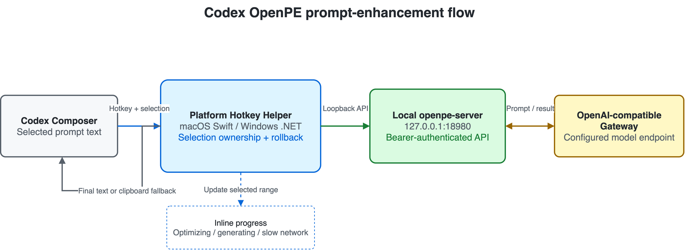

<a id="readme-top"></a>

<div align="right"><a href="#简体中文">简体中文</a> | <a href="#english">English</a></div>

<div align="center">

# Codex OpenPE Hotkey

Inline prompt enhancement for Codex, triggered by a configurable desktop shortcut.

<p>
  
</p>

<p>
  <a href="https://github.com/ChrysFu-FndVent/codex-openpe-hotkey/actions/workflows/ci.yml"></a>
  
  
  
  
  <a href="LICENSE"></a>
  <a href="https://github.com/ChrysFu-FndVent/codex-openpe-hotkey/stargazers"></a>
</p>

[快速使用](#zh-usage) · [自定义快捷键](#zh-hotkey) · [安装](#zh-getting-started) · [English](#english)

</div>

---

<a id="简体中文"></a>

## 简体中文

**中文项目名：Codex OpenPE 指令优化快捷键**

在 Codex 桌面输入框中选中提示词，按下全局快捷键，通过本地 [openPE](https://github.com/AoManoh/openpe) 服务优化指令。生成期间，输入框会直接显示动态进度；完成后，进度文字会被优化结果原地替换。

| 一眼概览 | 说明 |
| --- | --- |
| **触发方式** | macOS `Option+Q` · Windows `Alt+Q` · 支持自定义 |
| **交互位置** | 直接在 Codex 已选中的输入框文字中显示进度并替换结果 |
| **运行形态** | 无悬浮窗、无 Dock/任务栏图标、无菜单栏/系统托盘图标 |
| **本地链路** | 平台后台程序 → `127.0.0.1:18980` → openPE → OpenAI-compatible 网关 |
| **凭据存储** | macOS Keychain · Windows Credential Manager |

默认快捷键：

| 平台 | 默认值 | 可自定义 |
| --- | --- | --- |
| macOS 13+ | `Option+Q` | `Command`、`Control`、`Option`、`Shift` + 字母、数字或 `F1`–`F12` |
| Windows 10/11 | `Alt+Q` | `Ctrl`、`Alt`、`Shift`、`Win` + 字母、数字或 `F1`–`F12` |

<details>
<summary><strong>目录</strong></summary>

- [核心能力](#zh-features)
- [在 Codex 中快速使用](#zh-usage)
- [自定义快捷键](#zh-hotkey)
- [工作方式](#zh-architecture)
- [组件与插件](#zh-components)
- [快速开始](#zh-getting-started)
- [配置参考](#zh-configuration)
- [安全边界](#zh-security)
- [故障排查](#zh-troubleshooting)
- [开发与验证](#zh-development)
- [项目结构](#zh-structure)
- [贡献](#zh-contributing)
- [许可证](#zh-license)

</details>

<a id="zh-features"></a>

### ⚡ 核心能力

| 输入体验 | 可靠性与安全 |
| --- | --- |
| **输入框内优化**：直接处理选区，不显示额外界面 | **选区所有权保护**：焦点、窗口或选区变化后停止错误注入 |
| **可见生成进度**：展示阶段、动画和已用秒数 | **失败恢复**：失败或超时尽力恢复原文，必要时回退到剪贴板 |
| **双平台快捷键**：Carbon 与 Win32 `RegisterHotKey` | **本地安全边界**：只连接 loopback，并使用 bearer token |
| **快捷键可自定义**：支持修饰键与字母、数字、功能键组合 | **Codex 插件工作流**：Skill 协助安装、诊断、验证和卸载 |

输入框中的进度示例：

```text
[OpenPE ⠋] 正在优化 3s
[OpenPE ⠴] 仍在生成 20s
[OpenPE ⠧] 网络较慢 50s
```

<p align="right">(<a href="#readme-top">返回顶部</a>)</p>

<a id="zh-usage"></a>

### 💡 在 Codex 中快速使用

1. 打开 Codex 桌面输入框。
2. 选中需要优化的完整提示词。
3. 按状态脚本显示的快捷键。默认值为 macOS `Option+Q`、Windows `Alt+Q`。
4. 保持 Codex 窗口和选区不变。
5. 等待输入框内的动态进度被优化结果替换。

如果处理期间切换窗口或改变选区，后台程序会避免向错误位置写入，并在可能时恢复原文。原地替换成功时会恢复操作前的剪贴板；无法安全写回时，优化结果会保留在剪贴板中。

<a id="zh-hotkey"></a>

### ⌨️ 自定义快捷键

快捷键不区分大小写，必须包含至少一个修饰键和一个普通按键。不允许无修饰键的 `Q`、重复修饰键或未支持的按键。

macOS：

```bash
./scripts/install.sh --hotkey 'command+shift+p'
```

Windows：

```powershell
.\scripts\windows\configure.ps1 -HotKey "Ctrl+Shift+P"
```

支持的普通按键为 `A`–`Z`、`0`–`9`、`F1`–`F12`。若组合已被系统或其他应用占用，请更换组合并重新运行状态检查。再次运行安装脚本时，已有自定义快捷键会被保留。

<p align="right">(<a href="#readme-top">返回顶部</a>)</p>

<a id="zh-architecture"></a>

### 🏗️ 工作方式

<p align="center">
  
</p>

<p align="center"><sub>可编辑源文件：<a href="assets/readme/architecture.drawio">architecture.drawio</a></sub></p>

1. 用户在 Codex 输入框中选中文字并按下已配置的快捷键。
2. 平台后台程序确认前台应用、焦点与选区所有权，然后在原选区显示动态进度。
3. 后台程序携带本地 server token 请求 `127.0.0.1:18980` 上的 `openpe-server`。
4. `openpe-server` 调用用户配置的 OpenAI-compatible 网关和模型。
5. 若选区仍归本次请求所有，优化结果会原地替换进度文字；否则仅复制到剪贴板。

> [!NOTE]
> MCP 本身不能注册系统全局快捷键，也不能直接修改 Codex 原生输入框。本项目因此将 Codex 插件/Skill、平台后台程序和本地 openPE 服务分开实现。

<p align="right">(<a href="#readme-top">返回顶部</a>)</p>

<a id="zh-components"></a>

### 🧩 组件与插件

这不是单一 MCP 服务，而是一套各司其职的插件与桌面组件。Codex 插件负责工作流发现，平台后台程序负责系统快捷键和输入框选区，openPE 负责实际提示词优化。

| 组件 | 项目位置 | 职责 |
| --- | --- | --- |
| **Codex Marketplace** | [`.agents/plugins/marketplace.json`](.agents/plugins/marketplace.json) | 让其他用户从 GitHub 添加本仓库并发现插件 |
| **Codex Plugin** | [`.codex-plugin/plugin.json`](.codex-plugin/plugin.json) | 声明插件元数据、版本、能力和 Skill 目录 |
| **Codex Skill** | [`skills/codex-openpe-hotkey/SKILL.md`](skills/codex-openpe-hotkey/SKILL.md) | 指导 Codex 安装、配置、诊断、验证和卸载 |
| **macOS Helper** | [`Sources/CodexOpenPEHotkey/`](Sources/CodexOpenPEHotkey/) | Carbon 全局快捷键、Accessibility 选区操作和输入框内进度 |
| **Windows Helper** | [`windows/OpenPEHotkey.Windows.cs`](windows/OpenPEHotkey.Windows.cs) | Win32 快捷键、UI Automation、后台启动和进度替换 |
| **openPE Server** | [AoManoh/openpe](https://github.com/AoManoh/openpe) | 在本地提供提示词增强 API 并连接已配置模型网关 |

<p align="center">
  
  
  
  
</p>

> [!TIP]
> 只安装 Codex Plugin 会获得安装与诊断工作流；真正的系统全局快捷键仍由对应平台 Helper 注册。

<p align="right">(<a href="#readme-top">返回顶部</a>)</p>

<a id="zh-getting-started"></a>

### 🚀 快速开始

#### 1. 公共依赖

- Codex 或 ChatGPT 桌面版
- [Git](https://git-scm.com/)（使用 Git clone 时）
- [Go 1.25+](https://go.dev/dl/)（从源码构建当前 openPE）
- 一个可用的 OpenAI-compatible API key、网关和模型

构建 `openpe-server`：

```bash
git clone https://github.com/AoManoh/openpe.git
cd openpe
go install ./cmd/openpe-server
```

默认输出位置：macOS 为 `~/go/bin/openpe-server`，Windows 为 `%USERPROFILE%\go\bin\openpe-server.exe`。

#### 2. 获取项目文件

使用 Git：

```bash
git clone https://github.com/ChrysFu-FndVent/codex-openpe-hotkey.git
cd codex-openpe-hotkey
```

Windows PowerShell：

```powershell
git clone https://github.com/ChrysFu-FndVent/codex-openpe-hotkey.git
Set-Location .\codex-openpe-hotkey
```

也可以在 GitHub 仓库页面选择 **Code → Download ZIP**，解压后在项目根目录打开终端。

#### 3. 从 GitHub 安装 Codex 插件

仓库发布后运行：

```bash
codex plugin marketplace add ChrysFu-FndVent/codex-openpe-hotkey --ref main
codex plugin add codex-openpe-hotkey@codex-openpe-hotkey
```

新建一个 Codex 任务并调用：

```text
$codex-openpe-hotkey 帮我安装并验证当前系统的 OpenPE 快捷键
```

> [!IMPORTANT]
> 安装 Codex 插件只会提供安装和诊断工作流。全局快捷键仍需按下方步骤安装对应平台的后台程序。

#### 4A. Windows 安装

系统要求：Windows 10/11、Windows PowerShell 5.1、`.NET Framework 4.8`、Windows UI Automation。不要在 WSL 或 PowerShell 7 中运行。

```powershell
Set-ExecutionPolicy -Scope Process -ExecutionPolicy Bypass

.\scripts\windows\install.ps1 `
  -OpenPEServer "$env:USERPROFILE\go\bin\openpe-server.exe" `
  -BaseUrl "https://api.openai.com/v1" `
  -Model "gpt-5.4-mini"
```

脚本会安全提示输入 API key，并将它保存到 Windows Credential Manager。无需管理员权限。

核验：

```powershell
.\scripts\windows\status.ps1
```

状态必须同时确认 helper 正在运行、`health` 与 `authenticated info` 返回 HTTP 200，并且 Startup 快捷方式存在。

#### 4B. macOS 安装

系统要求：macOS 13+、Swift 5.9+、可执行的 `openpe-server`。

```bash
./scripts/configure.sh \
  --base-url https://api.openai.com/v1 \
  --model gpt-5.4-mini

./scripts/setup-local-signing.sh
./scripts/install.sh
```

`setup-local-signing.sh` 只需在每台 Mac 上运行一次。它会创建专用于本项目的本地代码签名证书和钥匙串，使应用更新后的辅助功能代码身份保持稳定。证书不上传、不包含 Apple Developer ID，也不用于发布或公证。

若 `openpe-server` 不在 `PATH` 或 `~/go/bin`：

```bash
./scripts/install.sh --openpe-server /absolute/path/to/openpe-server
```

首次使用该稳定签名安装时，在“系统设置 → 隐私与安全性 → 辅助功能”中添加并启用已安装的 `OpenPE Hotkey.app` 一次，然后运行：

```bash
./scripts/status.sh
```

只有状态输出中的 `accessibility: available` 才表示助手进程实际获得权限；系统设置中的开关外观本身不能作为验收依据。后续版本继续复用同一本地证书时，不需要因每次更新而重新授权。

<p align="right">(<a href="#readme-top">返回顶部</a>)</p>

<a id="zh-configuration"></a>

### ⚙️ 配置参考

| 配置 | 默认值 | 平台 | 用途 |
| --- | --- | --- | --- |
| `OPENPE_BASE_URL` / `BaseUrl` | 必填 | 双平台 | OpenAI-compatible 网关 |
| `OPENPE_MODEL` / `Model` | 必填 | 双平台 | 优化模型 |
| `OPENPE_LANGUAGE` / `Language` | `zh` | 双平台 | 优化结果语言 |
| `OPENPE_TIMEOUT` / `OpenPETimeout` | `60s` | 双平台 | openPE 上游超时 |
| `OPENPE_ENDPOINT` / `Endpoint` | `http://127.0.0.1:18980/v1/prompt-enhance` | 双平台 | 本地增强接口 |
| `OPENPE_HOTKEY_TIMEOUT_SECONDS` / `RequestTimeoutSeconds` | `75` | 双平台 | 快捷键客户端超时 |
| `OPENPE_HOTKEY` / `HotKey` | `Option+Q` / `Alt+Q` | macOS / Windows | 全局快捷键 |
| `OPENPE_ALLOWED_BUNDLE_IDS` | `com.openai.codex` | macOS | 允许响应的 bundle ID |
| `AllowedProcessNames` | `Codex,ChatGPT` | Windows | 允许响应的进程名 |
| `OPENPE_PROGRESS_LANGUAGE` / `ProgressLanguage` | `zh` | 双平台 | 输入框内进度语言 |
| `CODESIGN_IDENTITY` | 本地稳定身份或 `-` | macOS | 显式覆盖 macOS 签名身份；未设置时自动读取本地签名配置 |
| `CODESIGN_KEYCHAIN` | 本地专用钥匙串 | macOS | 与显式签名身份配套的可选钥匙串路径 |

Windows 更换网关、模型或 API key：

```powershell
.\scripts\windows\configure.ps1 `
  -BaseUrl "https://your-gateway.invalid/v1" `
  -Model "your-model"

.\scripts\windows\configure.ps1 -ReplaceApiKey
```

macOS 配置默认写入 `~/.config/openpe/.env`。可以为 `configure.sh` 和 `install.sh` 设置相同的 `OPENPE_CONFIG_DIR`，使用其他配置目录。

<a id="zh-security"></a>

### 🔒 安全边界

- 仅处理用户明确选中的文字，不读取未选中的输入框内容。
- 默认只响应 Codex/ChatGPT 允许列表中的桌面进程。
- API key 与 server token 分别保存在 macOS Keychain 或 Windows Credential Manager。
- 密钥不会写入仓库、JSON、`.env`、plist、快捷方式或命令行。
- 本地客户端只接受 loopback endpoint，并使用 bearer token 核验 `/v1/info`。
- PID 停止操作会核对命令行或可执行路径，避免 PID 复用导致误停其他进程。

<a id="zh-troubleshooting"></a>

### 🩺 故障排查

| 现象 | 检查项 |
| --- | --- |
| 按快捷键无反应 | 运行平台状态脚本，检查快捷键是否被其他应用占用 |
| macOS 只响提示音 | 运行 `scripts/status.sh`，必须看到 `accessibility: available`，并确认 Codex 在前台且已选中文字 |
| 更新后反复失去辅助功能权限 | 运行一次 `scripts/setup-local-signing.sh` 后重新安装；不要再用 ad-hoc 签名覆盖应用 |
| Windows 只响提示音 | 检查实际进程名是否在 `AllowedProcessNames` 中 |
| 进度停止或恢复原文 | 检查本地服务健康、网关模型和请求超时配置 |
| 结果没有原地写入 | 焦点或选区所有权已变化；检查剪贴板中的优化结果 |

日志位置：

```text
# macOS
~/Library/Logs/openpe-hotkey-error.log
~/Library/Logs/openpe-server-error.log

# Windows
%LOCALAPPDATA%\CodexOpenPEHotkey\hotkey-error.log
%LOCALAPPDATA%\CodexOpenPEHotkey\openpe-server.log
```

<a id="zh-development"></a>

### 🧪 开发与验证

macOS：

```bash
make validate
swift build -c release
```

Windows PowerShell：

```powershell
dotnet build .\windows\CodexOpenPEHotkey.Windows.csproj -c Release
.\scripts\windows\validate.ps1
```

GitHub Actions 会分别在 macOS 和 Windows runner 上构建对应实现。发布前仍应在两个平台的真实 Codex 输入框中执行快捷键端到端测试，因为自动化测试无法替代操作系统焦点、辅助功能和 UI Automation 验证。

<a id="zh-structure"></a>

### 📂 项目结构

<details>
<summary>展开目录</summary>

```text
.
├── .agents/plugins/marketplace.json       # Codex Marketplace
├── .codex-plugin/plugin.json              # 插件清单
├── Sources/                               # macOS Swift 后台程序
├── Tests/CoreSelfTests/                   # macOS 核心自检
├── windows/                               # Windows .NET Framework 后台程序
├── scripts/                               # macOS 安装和维护脚本
├── scripts/windows/                       # Windows 安装和维护脚本
├── launchd/                               # macOS LaunchAgent 模板
├── skills/codex-openpe-hotkey/            # Codex Skill
└── assets/readme/                         # README 架构图源文件与导出图
```

</details>

<a id="zh-contributing"></a>

### 🤝 贡献

欢迎提交问题和 Pull Request。修改运行时代码后，请执行对应平台构建、项目验证脚本、Codex 插件验证器和 Skill 验证器，并说明是否完成了真实 Codex 输入框端到端测试。

<a id="zh-license"></a>

### 📄 许可证

本项目使用 [MIT License](LICENSE)。

<p align="right">(<a href="#readme-top">返回顶部</a>)</p>

---

<a id="english"></a>

## English

**Chinese project name:** Codex OpenPE 指令优化快捷键

Select a prompt in the Codex desktop composer and press a global hotkey to enhance it through a local [openPE](https://github.com/AoManoh/openpe) service. The composer shows live progress in the selected range and replaces that progress with the enhanced prompt when generation finishes.

| At a glance | Details |
| --- | --- |
| **Trigger** | macOS `Option+Q` · Windows `Alt+Q` · fully customizable |
| **Interaction** | Shows progress inside the selected Codex composer text, then replaces it with the result |
| **Runtime shape** | No floating window, Dock/taskbar icon, menu bar item, or system tray icon |
| **Local path** | Platform helper → `127.0.0.1:18980` → openPE → OpenAI-compatible gateway |
| **Credential storage** | macOS Keychain · Windows Credential Manager |

Default shortcuts:

| Platform | Default | Customizable |
| --- | --- | --- |
| macOS 13+ | `Option+Q` | `Command`, `Control`, `Option`, `Shift` + a letter, digit, or `F1`–`F12` |
| Windows 10/11 | `Alt+Q` | `Ctrl`, `Alt`, `Shift`, `Win` + a letter, digit, or `F1`–`F12` |

<details>
<summary><strong>Table of Contents</strong></summary>

- [Features](#en-features)
- [Quick Use in Codex](#en-usage)
- [Custom Hotkeys](#en-hotkey)
- [Architecture](#en-architecture)
- [Components and Plugins](#en-components)
- [Getting Started](#en-getting-started)
- [Configuration](#en-configuration)
- [Security Boundaries](#en-security)
- [Troubleshooting](#en-troubleshooting)
- [Development and Validation](#en-development)
- [Project Structure](#en-structure)
- [Contributing](#en-contributing)
- [License](#en-license)

</details>

<a id="en-features"></a>

### ⚡ Features

| Input Experience | Reliability and Security |
| --- | --- |
| **Inline enhancement**: works directly in the selected range with no extra interface | **Selection ownership**: stops unsafe injection after focus, window, or selection changes |
| **Visible progress**: shows stage, animation, and elapsed seconds | **Failure recovery**: restores source text when possible and falls back to the clipboard |
| **Cross-platform hotkeys**: Carbon and Win32 `RegisterHotKey` | **Local boundary**: accepts only loopback endpoints and uses bearer authentication |
| **Custom shortcuts**: combines modifiers with letters, digits, or function keys | **Codex plugin workflow**: the Skill supports install, diagnosis, validation, and removal |

Inline progress example:

```text
[OpenPE ⠋] Optimizing 3s
[OpenPE ⠴] Still generating 20s
[OpenPE ⠧] Network is slow 50s
```

<p align="right">(<a href="#readme-top">back to top</a>)</p>

<a id="en-usage"></a>

### 💡 Quick Use in Codex

1. Open the Codex desktop composer.
2. Select the complete prompt you want to improve.
3. Press the shortcut shown by the status script. The defaults are `Option+Q` on macOS and `Alt+Q` on Windows.
4. Keep the Codex window and selection unchanged.
5. Wait for the inline progress text to be replaced by the enhanced prompt.

If the window or selection changes during processing, the helper avoids writing into the wrong location and restores the original text when possible. A successful inline replacement restores the previous clipboard; when safe write-back is impossible, the enhanced result remains on the clipboard.

<a id="en-hotkey"></a>

### ⌨️ Custom Hotkeys

Hotkeys are case-insensitive and must contain at least one modifier plus one ordinary key. A modifier-free `Q`, duplicate modifiers, and unsupported keys are rejected.

macOS:

```bash
./scripts/install.sh --hotkey 'command+shift+p'
```

Windows:

```powershell
.\scripts\windows\configure.ps1 -HotKey "Ctrl+Shift+P"
```

Supported ordinary keys are `A`–`Z`, `0`–`9`, and `F1`–`F12`. If another application or the operating system already owns the combination, choose another one and rerun the status check. Existing custom hotkeys are preserved when the installer is run again.

<p align="right">(<a href="#readme-top">back to top</a>)</p>

<a id="en-architecture"></a>

### 🏗️ Architecture

<p align="center">
  
</p>

<p align="center"><sub>Editable source: <a href="assets/readme/architecture.drawio">architecture.drawio</a></sub></p>

1. The user selects text in the Codex composer and presses the configured hotkey.
2. The platform helper verifies the foreground application, focus, and selection ownership, then renders progress in the selected range.
3. The helper calls `openpe-server` on `127.0.0.1:18980` with the local server token.
4. `openpe-server` calls the configured OpenAI-compatible gateway and model.
5. If the selection is still owned by the request, the result replaces the progress text; otherwise it is copied to the clipboard only.

> [!NOTE]
> MCP cannot register an operating-system global hotkey or directly modify the native Codex composer. The project therefore separates the Codex plugin/Skill, platform helper, and local openPE service.

<p align="right">(<a href="#readme-top">back to top</a>)</p>

<a id="en-components"></a>

### 🧩 Components and Plugins

This is not a single MCP service. It is a set of focused plugins and desktop components: the Codex plugin provides workflow discovery, each platform helper owns the global hotkey and composer selection, and openPE performs the prompt enhancement.

| Component | Project location | Responsibility |
| --- | --- | --- |
| **Codex Marketplace** | [`.agents/plugins/marketplace.json`](.agents/plugins/marketplace.json) | Lets users add this GitHub repository and discover the plugin |
| **Codex Plugin** | [`.codex-plugin/plugin.json`](.codex-plugin/plugin.json) | Declares plugin metadata, version, capabilities, and Skill directory |
| **Codex Skill** | [`skills/codex-openpe-hotkey/SKILL.md`](skills/codex-openpe-hotkey/SKILL.md) | Guides Codex through installation, configuration, diagnosis, validation, and removal |
| **macOS Helper** | [`Sources/CodexOpenPEHotkey/`](Sources/CodexOpenPEHotkey/) | Carbon hotkey, Accessibility selection control, and inline progress |
| **Windows Helper** | [`windows/OpenPEHotkey.Windows.cs`](windows/OpenPEHotkey.Windows.cs) | Win32 hotkey, UI Automation, background startup, and progress replacement |
| **openPE Server** | [AoManoh/openpe](https://github.com/AoManoh/openpe) | Exposes the local enhancement API and connects to the configured model gateway |

<p align="center">
  
  
  
  
</p>

> [!TIP]
> Installing only the Codex Plugin provides the installation and diagnostic workflow. The platform helper still registers the actual operating-system global hotkey.

<p align="right">(<a href="#readme-top">back to top</a>)</p>

<a id="en-getting-started"></a>

### 🚀 Getting Started

#### 1. Shared prerequisites

- Codex or ChatGPT desktop
- [Git](https://git-scm.com/) when cloning the repository
- [Go 1.25+](https://go.dev/dl/) to build the current openPE source
- An OpenAI-compatible API key, gateway, and model

Build `openpe-server`:

```bash
git clone https://github.com/AoManoh/openpe.git
cd openpe
go install ./cmd/openpe-server
```

The default output is `~/go/bin/openpe-server` on macOS and `%USERPROFILE%\go\bin\openpe-server.exe` on Windows.

#### 2. Get the project files

With Git:

```bash
git clone https://github.com/ChrysFu-FndVent/codex-openpe-hotkey.git
cd codex-openpe-hotkey
```

Windows PowerShell:

```powershell
git clone https://github.com/ChrysFu-FndVent/codex-openpe-hotkey.git
Set-Location .\codex-openpe-hotkey
```

Alternatively, choose **Code → Download ZIP** on the GitHub repository page, extract it, and open a terminal in the project root.

#### 3. Install the Codex plugin from GitHub

After the repository is published:

```bash
codex plugin marketplace add ChrysFu-FndVent/codex-openpe-hotkey --ref main
codex plugin add codex-openpe-hotkey@codex-openpe-hotkey
```

Start a new Codex task and invoke:

```text
$codex-openpe-hotkey Install and verify the OpenPE hotkey for this desktop platform.
```

> [!IMPORTANT]
> Installing the Codex plugin provides the installation and diagnostic workflow. The operating-system helper must still be installed using the platform steps below.

#### 4A. Install on Windows

Requirements: Windows 10/11, Windows PowerShell 5.1, `.NET Framework 4.8`, and Windows UI Automation. Do not run the helper under WSL or PowerShell 7.

```powershell
Set-ExecutionPolicy -Scope Process -ExecutionPolicy Bypass

.\scripts\windows\install.ps1 `
  -OpenPEServer "$env:USERPROFILE\go\bin\openpe-server.exe" `
  -BaseUrl "https://api.openai.com/v1" `
  -Model "gpt-5.4-mini"
```

The script securely prompts for the API key and stores it in Windows Credential Manager. Administrator privileges are not required.

Verify the installation:

```powershell
.\scripts\windows\status.ps1
```

The status must confirm that the helper is running, both `health` and `authenticated info` return HTTP 200, and the Startup shortcut exists.

#### 4B. Install on macOS

Requirements: macOS 13+, Swift 5.9+, and an executable `openpe-server`.

```bash
./scripts/configure.sh \
  --base-url https://api.openai.com/v1 \
  --model gpt-5.4-mini

./scripts/setup-local-signing.sh
./scripts/install.sh
```

Run `setup-local-signing.sh` once on each Mac. It creates a dedicated local code-signing certificate and keychain so the Accessibility code requirement remains stable across application updates. The certificate is never uploaded, is not an Apple Developer ID, and does not provide distribution or notarization trust.

If `openpe-server` is not on `PATH` or in `~/go/bin`:

```bash
./scripts/install.sh --openpe-server /absolute/path/to/openpe-server
```

For the first install with this stable identity, add and enable the installed `OpenPE Hotkey.app` once in System Settings → Privacy & Security → Accessibility, then run:

```bash
./scripts/status.sh
```

Only `accessibility: available` in the status output proves that the running helper has permission. The visual state of the System Settings toggle is not sufficient. Later builds signed with the same local identity should not require permission again.

<p align="right">(<a href="#readme-top">back to top</a>)</p>

<a id="en-configuration"></a>

### ⚙️ Configuration

| Setting | Default | Platform | Purpose |
| --- | --- | --- | --- |
| `OPENPE_BASE_URL` / `BaseUrl` | Required | Both | OpenAI-compatible gateway |
| `OPENPE_MODEL` / `Model` | Required | Both | Enhancement model |
| `OPENPE_LANGUAGE` / `Language` | `zh` | Both | Enhanced-output language |
| `OPENPE_TIMEOUT` / `OpenPETimeout` | `60s` | Both | openPE upstream timeout |
| `OPENPE_ENDPOINT` / `Endpoint` | `http://127.0.0.1:18980/v1/prompt-enhance` | Both | Local enhancement endpoint |
| `OPENPE_HOTKEY_TIMEOUT_SECONDS` / `RequestTimeoutSeconds` | `75` | Both | Hotkey client timeout |
| `OPENPE_HOTKEY` / `HotKey` | `Option+Q` / `Alt+Q` | macOS / Windows | Global hotkey |
| `OPENPE_ALLOWED_BUNDLE_IDS` | `com.openai.codex` | macOS | Allowed bundle IDs |
| `AllowedProcessNames` | `Codex,ChatGPT` | Windows | Allowed process names |
| `OPENPE_PROGRESS_LANGUAGE` / `ProgressLanguage` | `zh` | Both | Inline progress language |
| `CODESIGN_IDENTITY` | stable local identity or `-` | macOS | Explicit macOS signing override; otherwise the installer loads the local signing configuration |
| `CODESIGN_KEYCHAIN` | dedicated local keychain | macOS | Optional keychain path paired with an explicit signing identity |

Change the Windows gateway, model, or API key:

```powershell
.\scripts\windows\configure.ps1 `
  -BaseUrl "https://your-gateway.invalid/v1" `
  -Model "your-model"

.\scripts\windows\configure.ps1 -ReplaceApiKey
```

The macOS configuration is written to `~/.config/openpe/.env` by default. Set the same `OPENPE_CONFIG_DIR` for `configure.sh` and `install.sh` to use another directory.

<a id="en-security"></a>

### 🔒 Security Boundaries

- Processes only text the user explicitly selected; it does not read unselected composer content.
- Responds only to desktop applications in the platform allowlist by default.
- Stores the API key and server token in macOS Keychain or Windows Credential Manager.
- Does not place secrets in the repository, JSON, `.env`, plist, shortcut, or command line.
- Accepts only a loopback client endpoint and verifies `/v1/info` with the bearer token.
- Verifies command line or executable path before stopping a PID, reducing the risk of terminating a reused PID.

<a id="en-troubleshooting"></a>

### 🩺 Troubleshooting

| Symptom | Check |
| --- | --- |
| The shortcut does nothing | Run the platform status script and check whether another application owns the shortcut |
| macOS only plays a beep | Run `scripts/status.sh`, require `accessibility: available`, then confirm Codex focus and a non-empty selection |
| Accessibility permission is lost after every update | Run `scripts/setup-local-signing.sh` once and reinstall; do not replace the app with an ad-hoc-signed build |
| Windows only plays a beep | Confirm the actual process name is in `AllowedProcessNames` |
| Progress stops or original text returns | Check local service health, gateway model availability, and timeouts |
| Result is not applied inline | Focus or selection ownership changed; inspect the clipboard for the enhanced prompt |

Log locations:

```text
# macOS
~/Library/Logs/openpe-hotkey-error.log
~/Library/Logs/openpe-server-error.log

# Windows
%LOCALAPPDATA%\CodexOpenPEHotkey\hotkey-error.log
%LOCALAPPDATA%\CodexOpenPEHotkey\openpe-server.log
```

<a id="en-development"></a>

### 🧪 Development and Validation

macOS:

```bash
make validate
swift build -c release
```

Windows PowerShell:

```powershell
dotnet build .\windows\CodexOpenPEHotkey.Windows.csproj -c Release
.\scripts\windows\validate.ps1
```

GitHub Actions builds and validates the platform implementations on separate macOS and Windows runners. A real Codex composer hotkey test is still required on both platforms before release because automated checks cannot replace operating-system focus, Accessibility, or UI Automation validation.

<a id="en-structure"></a>

### 📂 Project Structure

<details>
<summary>Expand the directory map</summary>

```text
.
├── .agents/plugins/marketplace.json       # Codex Marketplace
├── .codex-plugin/plugin.json              # Plugin manifest
├── Sources/                               # macOS Swift helper
├── Tests/CoreSelfTests/                   # macOS core self-tests
├── windows/                               # Windows .NET Framework helper
├── scripts/                               # macOS install and maintenance
├── scripts/windows/                       # Windows install and maintenance
├── launchd/                               # macOS LaunchAgent templates
├── skills/codex-openpe-hotkey/            # Codex Skill
└── assets/readme/                         # README diagram source and export
```

</details>

<a id="en-contributing"></a>

### 🤝 Contributing

Issues and pull requests are welcome. After changing runtime code, run the platform build, project validation script, Codex plugin validator, and Skill validator. State whether a real Codex composer end-to-end test was completed.

<a id="en-license"></a>

### 📄 License

Released under the [MIT License](LICENSE).

<p align="right">(<a href="#readme-top">back to top</a>)</p>
